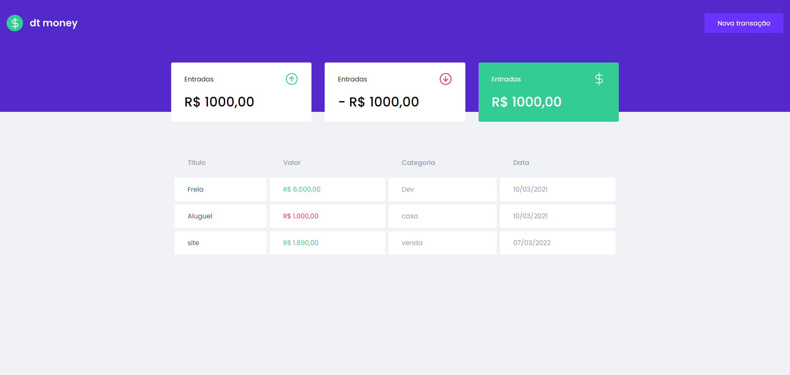
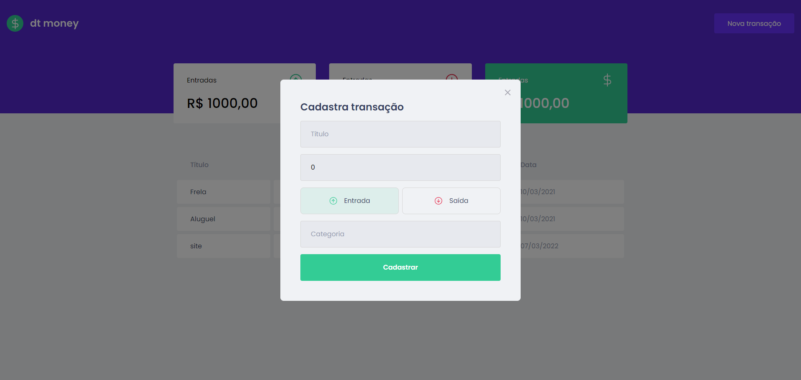

# Primeira aplicação web com ReactJS
## Resumo e descrição do projeto

Modulo 2 do Bootcamp Ignite, desenvolvido pela empresa Rocketseat.<br/>
Onde consiste em criar uma aplicação de controle de gastos, onde cadastramos os gastos realizado
## Imagens
| 
| :---: | :---: |
### Link do Figma

https://www.figma.com/file/0xmu9mj2TJYoIOubBFWsk5/dtmoney-Ignite-(Copy)?node-id=0%3A1


## Tutorial de instalação

Clone o projeto

```term

git clone git@github.com:moraes3000/ignite-First-web-application-with-ReactJS.git

```

Instale as dependências

```term

yarn

```

Rode o projeto

```term

yarn dev

```

Acesse o seguinte endereço

```term

http://127.0.0.1:8080/

```

## Instalando styled-components
```term
yarn add styled-components
```

## Consumindo api local para teste
- precisa de um servidor node https://github.com/typicode/json-server

- https://miragejs.com/

##  yarn add react-modal
-  https://github.com/reactjs/react-modal

### Passando uma função como parametro
Chamando no Header e Passando os parâmetros App

